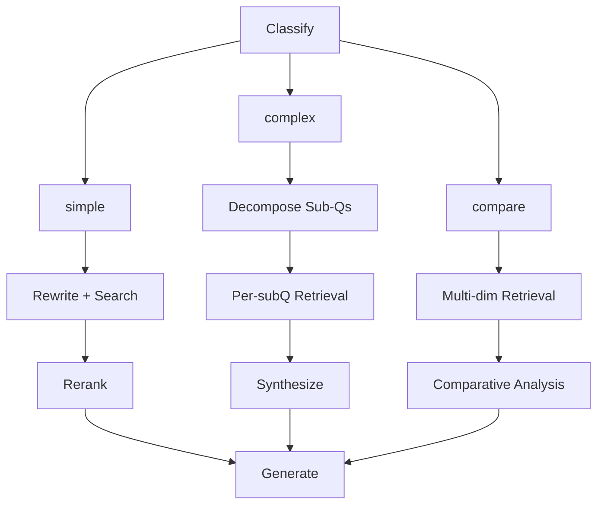

# Agent Mode

The Agent (`--mode agent`) uses a **LangGraph** state graph that automatically selects the optimal processing path based on query type.

## Flow



## Processing Paths

| Path        | Use Case                         | Pipeline                                    |
| ----------- | -------------------------------- | ------------------------------------------- |
| **simple**  | Direct, factual questions        | Rewrite → Search → Rerank → Generate        |
| **complex** | Multi-faceted analysis questions | Decompose → Per-subQ Retrieval → Synthesize |
| **compare** | Comparison/contrast questions    | Multi-dim Retrieval → Comparative Analysis  |

## Usage

```bash
# Single query in agent mode
uv run sckb query "Compare the alarm and configuration systems" --mode agent

# Chat in agent mode
uv run sckb chat --mode agent

# Switch mode during chat
/mode agent
```

## How Classification Works

The LLM-based classifier analyzes the query and routes it to the appropriate path:

- **simple** — Direct questions with a single focus (e.g., "What is alarm suppression?")
- **complex** — Questions requiring analysis across multiple aspects (e.g., "How does the initialization system handle errors and recovery?")
- **compare** — Questions explicitly asking for comparison (e.g., "Compare the alarm and configuration management systems")

## Pipeline Details

### Simple Path

1. **Query Rewrite** — LLM generates multiple angles of the query for better recall
2. **Vector Search** — Retrieves candidates from ChromaDB
3. **Reranking** — CrossEncoder re-scores candidates
4. **Generation** — LLM generates the final answer with source citations

### Complex Path

1. **Decomposition** — LLM breaks the query into sub-questions
2. **Per-subQ Retrieval** — Each sub-question is independently searched
3. **Synthesis** — LLM synthesizes all sub-question results into a comprehensive answer

### Compare Path

1. **Multi-dimensional Retrieval** — Retrieves documents for each entity being compared
2. **Comparative Analysis** — LLM generates a structured comparison across dimensions
