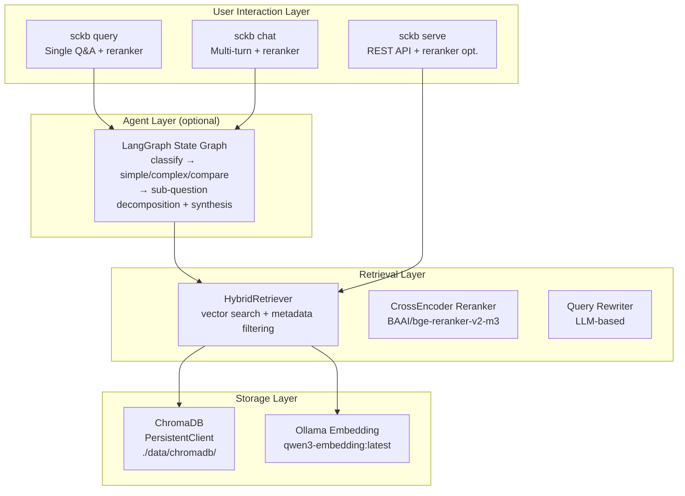

# Architecture

## System Overview



## Layers

### User Interaction Layer

Three entry points for different use cases:

- **`sckb query`** — Single question, single answer. Supports reranking.
- **`sckb chat`** — Multi-turn conversation with history. Supports reranking.
- **`sckb serve`** — REST API for programmatic access. Optional reranking per request.

### Agent Layer (Optional)

The LangGraph-based agent automatically classifies queries and selects the optimal processing path. See [Agent Mode](agent-mode.md) for details.

### Retrieval Layer

- **HybridRetriever** — Combines vector similarity search with metadata filtering (domain, topic, scope, tags).
- **CrossEncoder Reranker** — Local `BAAI/bge-reranker-v2-m3` model re-scores candidates for higher relevance.
- **Query Rewriter** — LLM-based multi-angle query expansion for better recall.

### Storage Layer

- **ChromaDB** — Persistent vector database with local file storage.
- **Ollama Embedding** — Embedding model service for vectorizing documents and queries.

## Reranker Scope

| Interface                          | Reranker applied                             |
| ---------------------------------- | -------------------------------------------- |
| `sckb query`                       | Yes (when `use_reranker: true`)              |
| `sckb chat`                        | Yes (when `use_reranker: true`)              |
| `POST /api/v1/search`              | Optional (`use_reranker` param, default off) |
| `POST /api/v1/search/hierarchical` | No — raw vector retrieval only               |

## Project Structure

```
source-code-knowledge-base/
├── config.yaml                # Runtime configuration
├── config.yaml.example        # Configuration template
├── pyproject.toml             # Project definition and dependencies
├── README.md
├── docs/
│   ├── en/                    # English documentation
│   └── zh/                    # Chinese documentation
├── scripts/
│   └── sckb-cli.py           # REST API client script
├── tests/
│   ├── test_data.jsonl        # Test data (10 records, 4 topics)
│   ├── multi_domain.jsonl     # Multi-domain test data
│   └── test_recall.py         # Comprehensive test suite
├── data/
│   └── chromadb/              # ChromaDB persistence (generated at runtime)
└── src/source_code_kb/
    ├── __init__.py            # pysqlite3 shim + package init
    ├── config.py              # Configuration loading (YAML → dataclasses)
    ├── cli.py                 # CLI entry point (typer)
    ├── ingest/
    │   ├── jsonl_loader.py    # JSONL parsing → LangChain Document
    │   └── indexer.py         # Embedding + ChromaDB storage/query
    ├── retrieval/
    │   ├── retriever.py       # HybridRetriever (vector + metadata filtering)
    │   ├── query_rewriter.py  # LLM-based query expansion
    │   └── reranker.py        # Local CrossEncoder reranker
    ├── generation/
    │   ├── prompts.py         # Prompt templates (RAG, history, agent)
    │   └── generator.py       # RAG answer generation + streaming
    ├── agent/
    │   ├── state.py           # LangGraph agent state
    │   ├── nodes.py           # Graph node functions
    │   └── graph.py           # State graph construction and execution
    ├── chat/
    │   └── session.py         # Multi-turn conversation history
    └── server/
        ├── schemas.py         # Pydantic request/response models
        ├── routes.py          # FastAPI routes
        └── app.py             # FastAPI application factory
```
