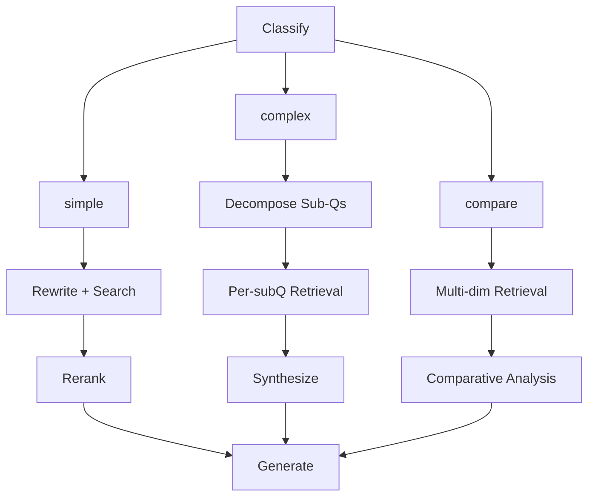

# Agent 模式

Agent（`--mode agent`）使用基于 **LangGraph** 的状态图，根据查询类型自动选择最优处理路径。

## 处理流程



## 处理路径

| 路径        | 适用场景           | 流程                             |
| ----------- | ------------------ | -------------------------------- |
| **simple**  | 直接的事实性问题   | 查询重写 → 搜索 → 重排序 → 生成  |
| **complex** | 多方面的分析性问题 | 子问题分解 → 逐一检索 → 综合生成 |
| **compare** | 比较/对比类问题    | 多维度检索 → 对比分析            |

## 使用方法

```bash
# Single query in agent mode
uv run sckb query "Compare the alarm and configuration systems" --mode agent

# Chat in agent mode
uv run sckb chat --mode agent

# Switch mode during chat
/mode agent
```

## 分类机制

基于 LLM 的分类器分析查询并路由到相应路径：

- **simple** — 单一焦点的直接问题（如"什么是告警抑制？"）
- **complex** — 需要多方面分析的问题（如"初始化系统如何处理错误和恢复？"）
- **compare** — 明确要求进行比较的问题（如"比较告警和配置管理系统"）

## 路径详细说明

### Simple 路径

1. **查询重写** — LLM 从多个角度生成查询变体，提升召回率
2. **向量搜索** — 从 ChromaDB 检索候选文档
3. **重排序** — CrossEncoder 对候选结果重新评分
4. **答案生成** — LLM 生成带来源引用的最终答案

### Complex 路径

1. **子问题分解** — LLM 将查询拆分为多个子问题
2. **逐一检索** — 每个子问题独立进行搜索
3. **综合生成** — LLM 将所有子问题的结果综合为完整答案

### Compare 路径

1. **多维度检索** — 分别检索每个对比实体的文档
2. **对比分析** — LLM 跨维度生成结构化的对比分析
