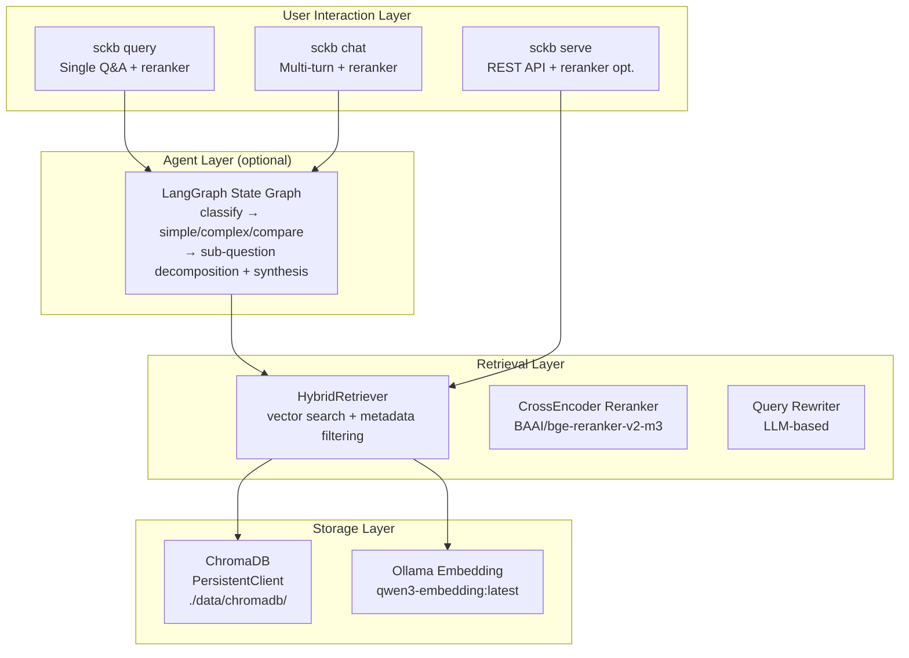

# 系统架构

## 总体架构



## 各层说明

### 用户交互层

提供三种入口，适用于不同场景：

- **`sckb query`** — 单次问答，支持重排序。
- **`sckb chat`** — 多轮对话，自动维护会话历史，支持重排序。
- **`sckb serve`** — REST API，供程序化调用，可按请求启用重排序。

### Agent 层（可选）

基于 LangGraph 的智能体自动对查询进行分类，选择最优处理路径。详见 [Agent 模式](agent-mode.md)。

### 检索层

- **HybridRetriever** — 将向量相似度搜索与元数据过滤（domain、topic、scope、tags）相结合。
- **CrossEncoder 重排序器** — 本地 `BAAI/bge-reranker-v2-m3` 模型对候选结果重新评分，提高相关性。
- **查询重写器** — 基于 LLM 的多角度查询扩展，提升召回率。

### 存储层

- **ChromaDB** — 持久化向量数据库，本地文件存储。
- **Ollama Embedding** — Embedding 模型服务，用于文档和查询的向量化。

## 重排序范围

| 接口                               | 重排序行为                            |
| ---------------------------------- | ------------------------------------- |
| `sckb query`                       | 启用（当 `use_reranker: true`）       |
| `sckb chat`                        | 启用（当 `use_reranker: true`）       |
| `POST /api/v1/search`              | 可选（`use_reranker` 参数，默认关闭） |
| `POST /api/v1/search/hierarchical` | 不应用 — 仅返回原始向量检索结果       |

## 项目结构

```
source-code-knowledge-base/
├── config.yaml                # 运行时配置
├── config.yaml.example        # 配置模板
├── pyproject.toml             # 项目定义和依赖
├── README.md
├── docs/
│   ├── en/                    # 英文文档
│   └── zh/                    # 中文文档
├── scripts/
│   └── sckb-cli.py           # REST API 客户端脚本
├── tests/
│   ├── test_data.jsonl        # 测试数据（10 条记录，4 个主题）
│   ├── multi_domain.jsonl     # 多域测试数据
│   └── test_recall.py         # 综合测试套件
├── data/
│   └── chromadb/              # ChromaDB 持久化（运行时生成）
└── src/source_code_kb/
    ├── __init__.py            # pysqlite3 shim + 包初始化
    ├── config.py              # 配置加载（YAML → dataclasses）
    ├── cli.py                 # CLI 入口（typer）
    ├── ingest/
    │   ├── jsonl_loader.py    # JSONL 解析 → LangChain Document
    │   └── indexer.py         # Embedding + ChromaDB 存储/查询
    ├── retrieval/
    │   ├── retriever.py       # HybridRetriever（向量 + 元数据过滤）
    │   ├── query_rewriter.py  # 基于 LLM 的查询扩展
    │   └── reranker.py        # 本地 CrossEncoder 重排序器
    ├── generation/
    │   ├── prompts.py         # Prompt 模板（RAG、历史、Agent）
    │   └── generator.py       # RAG 答案生成 + 流式输出
    ├── agent/
    │   ├── state.py           # LangGraph Agent 状态
    │   ├── nodes.py           # 图节点函数
    │   └── graph.py           # 状态图构建与执行
    ├── chat/
    │   └── session.py         # 多轮对话历史管理
    └── server/
        ├── schemas.py         # Pydantic 请求/响应模型
        ├── routes.py          # FastAPI 路由
        └── app.py             # FastAPI 应用工厂
```
